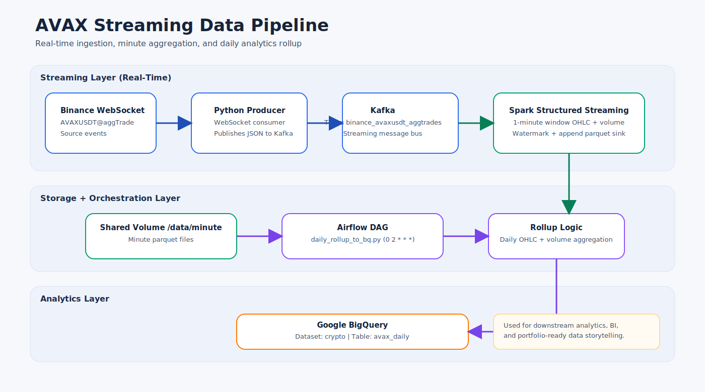
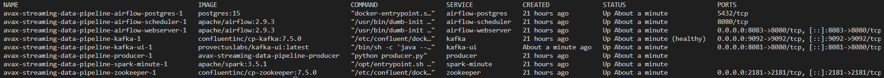
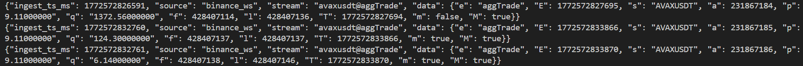
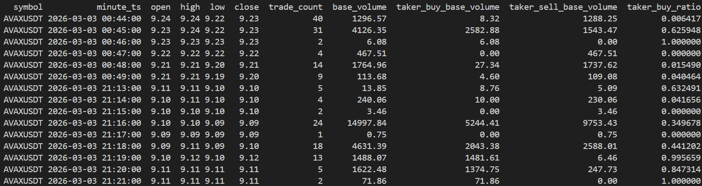
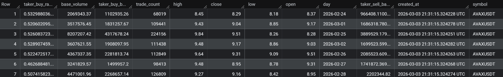

# AVAX Streaming Data Pipeline

Real-time crypto market data pipeline built for a Data Engineering portfolio.
The system ingests live AVAXUSDT aggTrades from Binance, transforms them into minute-level aggregates, and publishes daily analytics to BigQuery.

## Why this project matters
- Demonstrates end-to-end streaming architecture, not just batch ETL.
- Shows practical orchestration with Airflow and production-like containerized deployment.
- Includes data modeling for analytics-ready OHLC/volume metrics.
- Uses cloud warehouse integration (BigQuery) for downstream BI and reporting.

## Architecture

```text
Binance WebSocket (aggTrade)
  -> Python Producer
  -> Kafka topic (binance_avaxusdt_aggtrades)
  -> Spark Structured Streaming
  -> Minute parquet (/data/minute)
  -> Airflow daily rollup
  -> BigQuery (crypto.avax_daily)
```



## Tech Stack
- Python 3.11
- Apache Kafka + ZooKeeper
- Apache Spark Structured Streaming
- Apache Airflow 2.9
- Google BigQuery
- Docker Compose

## Data Model
Minute-level output (`/data/minute`):
- `symbol`
- `minute_ts`
- `open`, `high`, `low`, `close`
- `trade_count`
- `base_volume`
- `taker_buy_base_volume`, `taker_sell_base_volume`
- `taker_buy_ratio`

Daily analytics table (`crypto.avax_daily`):
- `symbol`
- `day`
- `open`, `high`, `low`, `close`
- `trade_count`
- `base_volume`
- `taker_buy_base_volume`, `taker_sell_base_volume`
- `taker_buy_ratio`
- `created_at`

## Run Locally
Prerequisites:
- Docker Desktop
- GCP service account key at `airflow/secret/gcp-sa.json`

Start:
```powershell
docker compose up -d zookeeper kafka producer spark-minute airflow-postgres airflow-init airflow-webserver airflow-scheduler
```

Services:
- Airflow UI: `http://localhost:8083`
- Kafka UI: `http://localhost:8081`

Stop:
```powershell
docker compose stop
```

## Project Results
Pipeline services running:


Live Kafka message sample:


Minute-level aggregates generated by Spark:


Final daily output in BigQuery:


## Notes
- Daily rollup loads data into BigQuery with append strategy.
- For environments with billing enabled, day-level overwrite/dedup logic can be enabled for stricter idempotency.
